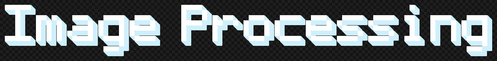

<a href="https://x.com/nearcyan/status/1706914605262684394">
  <picture>
    <source media="(prefers-color-scheme: dark)" srcset="assets/image-processing-dark.png">
    
  </picture>
</a>


**Welcome to the 3rd lab session of Computer *Vision I* at Comillas ICAI**. Here, you will find all the necessary files to complete this session. 💻📷


## Resources

This laboratory session contains the following:

- 📄 **``CVI_lab_3.pdf``**: A ``PDF`` guide with instructions to complete the session (currently only available in Spanish).
- 💻 **Scripts**: Three ``.ipynb`` files (one per part: Corner Detection, Edge Detection, and SIFT and Bag of Words). The folder also includes multiple helper scripts.
- 🎞️ **Data**: A folder containing images to process.
- 📝 **Template**: A folder with a ``latex`` template used to generate the guide. You can reuse it to write your report.
- 🧩 **Assets**: Files to style or improve documentation.
- 📖 **README**: With links to motivate the session or to introduce the theory concepts.

The lab session folder is structured as follows:

```bash
.
├── CVI_lab_3.pdf
├── src
│   ├── partA-B.ipynb
│   └── utils.py
├── data
│   └── partA-B
│     ├── 000.png
│     ├── 001.png
│     ├── ...
|     ...
├── assets
├── template
└── README
```

## Get ready 🤓
If you're not enrolled or don't have access to the theory, or just want a refresher, check out the resources below before starting the lab.

- [Corner and Edge Detection](https://www.youtube.com/watch?v=Z_HwkG90Yvw&t=0s)
- [SIFT Detector Algorithm](https://www.youtube.com/watch?v=KgsHoJYJ4S8&list=PLlCkKK04bmVlvCs-S-2DnGf08MY2Hdd0n&index=1)

<h2 align="center">Here we go: Lesson 3!</h2>
<p align="center">
  
</p>